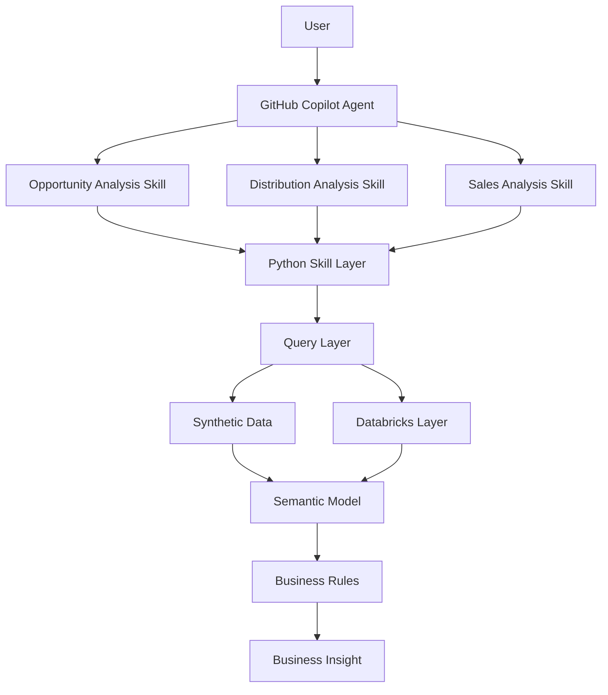

THEMIS

A portfolio project demonstrating a GitHub Copilot agent architecture for FMCG analytics.

The project combines a custom GitHub Copilot agent, reusable Agent Skills, a semantic model, business rules, and an executable Python analytics layer. It uses synthetic FMCG data, none of this data is real or derived from any real enterprise.

Architecture

User
  │
  ▼
GitHub Copilot Agent
  │
  ├── Opportunity Analysis Skill
  ├── Distribution Analysis Skill
  └── Sales Analysis Skill
          │
          ▼
     Python Skill Layer
          │
          ▼
       Query Layer
          │
     ┌────┴────┐
     ▼         ▼
Synthetic    Databricks
  Data        Layer
     │
     ▼
Semantic Model
     │
     ▼
Business Rules
     │
     ▼
Business Insight

What This Project Demonstrates

* GitHub Copilot custom agents
* GitHub Copilot Agent Skills
* Skill-based agent orchestration
* Semantic modeling
* Business-rule-driven analytics
* Python and PySpark
* FMCG sales analysis
* Distribution analysis
* Distribution opportunity identification
* Delta-style analytical data
* Databricks integration
* Synthetic data generation
* Automated testing

Repository Structure

root/
│
├── .github/
│   ├── agents/
│   │   └── themis.agent.md
│   │
│   └── skills/
│       ├── opportunity-analysis/
│       │   └── SKILL.md
│       │
│       ├── distribution-analysis/
│       │   └── SKILL.md
│       │
│       └── sales-analysis/
│           └── SKILL.md
│
├── config/
│   └── semantic_model.yaml
│
├── src/
│   ├── agent/
│   ├── data/
│   ├── semantic/
│   └── skills/
│
├── tests/
│
├── demo/
│
├── .env.example
├── .gitignore
├── README.md
└── requirements.txt

Core Components

GitHub Copilot Agent

The custom agent acts as the orchestration layer.

It identifies the type of FMCG question being asked and selects the appropriate analytical skill.

The agent does not contain the analytical calculations itself. Instead, it delegates the calculations to the repository’s executable Python implementation.

Agent Skills

The project contains three analytical skills:

Opportunity Analysis

Identifies distribution gaps and prioritizes potential opportunities based on the project’s defined business rules.

Distribution Analysis

Analyzes store and SKU coverage, including distribution gaps and product presence.

Sales Analysis

Analyzes sales performance across brands, SKUs, stores, and customers.

Semantic Model

The semantic model defines the dimensions, measures, hierarchies, and business concepts used by the analytical layer.

This provides a consistent interpretation of business questions and prevents individual skills from independently redefining metrics.

Python Analytics Layer

The Python layer contains the actual implementation behind the skills.

This layer handles:

* Data generation
* Data access
* Query execution
* Business calculations
* Opportunity ranking
* Distribution calculations
* Sales calculations

The Agent Skills provide the instructions and orchestration, while Python performs the executable analysis.

Data

The repository uses synthetic FMCG data generated specifically for this project.

The synthetic dataset contains concepts such as:

* Brands
* SKUs
* Products
* Stores
* Customers
* Sales
* Distribution
* Distribution gaps

The data is designed to reproduce realistic analytical scenarios without using proprietary business data.

Running Locally

Create a virtual environment:

python -m venv .venv

Activate it on macOS or Linux:

source .venv/bin/activate

Activate it on Windows:

.venv\Scripts\activate

Install the dependencies:

pip install -r requirements.txt

Run opportunity analysis:

python -m src.skills.cli --skill opportunity --brand "Brand A" --limit 10

Run distribution analysis:

python -m src.skills.cli --skill distribution --brand "Brand A"

Run sales analysis:

python -m src.skills.cli --skill sales --brand "Brand A"

Testing

Run the test suite with:

pytest

Databricks

The project also contains a Databricks integration layer.

Databricks configuration is provided through environment variables rather than being stored in the repository.

Copy the example configuration:

cp .env.example .env

Then configure the required Databricks connection values in .env.

Never commit credentials, tokens, or other secrets to the repository.

Design Principles

Separation of concerns

The agent, skills, semantic model, business logic, and data layer are kept separate.

Reusable skills

Each analytical capability can be invoked independently and can be reused by the Copilot agent.

Semantic consistency

Business metrics are defined centrally instead of being independently interpreted by each skill.

Executable implementation

The project is not only a collection of agent instructions. The analytical skills are backed by executable Python code.

Public-safe data

All analytical examples use synthetic data.

No proprietary datasets, credentials, company-specific schemas, or confidential business rules are included.

Example Questions

The Copilot agent can be used for questions such as:

Which SKUs represent the largest distribution opportunities for Brand A?
Which Brand A SKUs have the lowest store coverage?
How much sales does Brand A generate?
Which products have the largest distribution gaps?
Which SKUs should be prioritized for distribution expansion?

The agent selects the relevant skill and uses the repository’s analytical implementation to calculate the result.

Project Goal

The goal of this project is to demonstrate how AI agents can be connected to structured business data and domain-specific analytical capabilities.
# THEMIS

### A GitHub Copilot agent architecture for FMCG analytics

THEMIS combines a custom GitHub Copilot agent, reusable Agent Skills, a semantic model, business rules, and an executable Python analytics layer.

> **Data notice:** This project uses synthetic FMCG data. None of the data is real or derived from a real enterprise.

## Contents

- [Architecture](#architecture)
- [What This Project Demonstrates](#what-this-project-demonstrates)
- [Core Components](#core-components)
- [Data](#data)
- [Running Locally](#running-locally)
- [Testing](#testing)
- [Databricks](#databricks)
- [Design Principles](#design-principles)
- [Example Questions](#example-questions)

## Architecture



## What This Project Demonstrates

- GitHub Copilot custom agents
- GitHub Copilot Agent Skills
- Skill-based agent orchestration
- Semantic modeling
- Business-rule-driven analytics
- Python and PySpark
- FMCG sales analysis
- Distribution analysis
- Distribution opportunity identification
- Delta-style analytical data
- Databricks integration
- Synthetic data generation
- Automated testing

## Repository Structure

```text
.
├── .github/
│   ├── agents/
│   │   └── themis.agent.md
│   └── skills/
│       ├── opportunity-analysis/
│       │   └── SKILL.md
│       ├── distribution-analysis/
│       │   └── SKILL.md
│       └── sales-analysis/
│           └── SKILL.md
├── config/
│   └── semantic_model.yaml
├── src/
│   ├── agent/
│   ├── data/
│   ├── semantic/
│   └── skills/
├── tests/
├── demo/
├── .env.example
├── .gitignore
├── README.md
└── requirements.txt
```

## Core Components

### GitHub Copilot Agent

The custom agent acts as the orchestration layer. It identifies the type of FMCG question being asked and selects the appropriate analytical skill.

The agent does not perform the analytical calculations itself. Instead, it delegates those calculations to the repository's executable Python implementation.

### Agent Skills

The project contains three analytical skills:

| Skill | Purpose |
| --- | --- |
| **Opportunity Analysis** | Identifies distribution gaps and prioritizes potential opportunities using the project's business rules. |
| **Distribution Analysis** | Analyzes store and SKU coverage, including distribution gaps and product presence. |
| **Sales Analysis** | Analyzes sales performance across brands, SKUs, stores, and customers. |

### Semantic Model

The semantic model defines the dimensions, measures, hierarchies, and business concepts used by the analytical layer.

This provides a consistent interpretation of business questions and prevents individual skills from independently redefining metrics.

### Python Analytics Layer

The Python layer contains the executable implementation behind the skills. It handles:

- Data generation
- Data access
- Query execution
- Business calculations
- Opportunity ranking
- Distribution calculations
- Sales calculations

The Agent Skills provide the instructions and orchestration; Python performs the executable analysis.

## Data

The repository uses synthetic FMCG data generated specifically for this project. The dataset contains concepts such as:

- Brands
- SKUs
- Products
- Stores
- Customers
- Sales
- Distribution
- Distribution gaps

The data is designed to reproduce realistic analytical scenarios without using proprietary business data.

## Running Locally

### 1. Create a virtual environment

```bash
python -m venv .venv
```

### 2. Activate the environment

**macOS or Linux**

```bash
source .venv/bin/activate
```

**Windows**

```powershell
.venv\Scripts\activate
```

### 3. Install dependencies

```bash
pip install -r requirements.txt
```

### 4. Run an analysis

**Opportunity analysis**

```bash
python -m src.skills.cli --skill opportunity --brand "Brand A" --limit 10
```

**Distribution analysis**

```bash
python -m src.skills.cli --skill distribution --brand "Brand A"
```

**Sales analysis**

```bash
python -m src.skills.cli --skill sales --brand "Brand A"
```

## Testing

Run the test suite with:

```bash
pytest
```

## Databricks

The project also contains a Databricks integration layer. Databricks configuration is provided through environment variables rather than being stored in the repository.

Copy the example configuration:

```bash
cp .env.example .env
```

Then configure the required Databricks connection values in `.env`.

> Never commit credentials, tokens, or other secrets to the repository.

## Design Principles

| Principle | Description |
| --- | --- |
| **Separation of concerns** | The agent, skills, semantic model, business logic, and data layer are kept separate. |
| **Reusable skills** | Each analytical capability can be invoked independently and reused by the Copilot agent. |
| **Semantic consistency** | Business metrics are defined centrally instead of being independently interpreted by each skill. |
| **Executable implementation** | The analytical skills are backed by executable Python code, not only agent instructions. |
| **Public-safe data** | All examples use synthetic data; no proprietary datasets, credentials, company-specific schemas, or confidential business rules are included. |

## Example Questions

The Copilot agent can answer questions such as:

- Which SKUs represent the largest distribution opportunities for Brand A?
- Which Brand A SKUs have the lowest store coverage?
- How much sales does Brand A generate?
- Which products have the largest distribution gaps?
- Which SKUs should be prioritized for distribution expansion?

The agent selects the relevant skill and uses the repository's analytical implementation to calculate the result.

## Disclaimer

This is an independent portfolio project using synthetic data. It does not contain or reproduce proprietary company data, credentials, code, prompts, schemas, or confidential business logic.

Rather than relying solely on a general-purpose language model, the architecture combines agent orchestration with deterministic analytical code, semantic definitions, and business rules.

This creates a more controlled approach to answering business questions from structured FMCG data.

Disclaimer

This is an independent portfolio project using synthetic data.

It does not contain or reproduce proprietary company data, credentials, code, prompts, schemas, or confidential business logic.